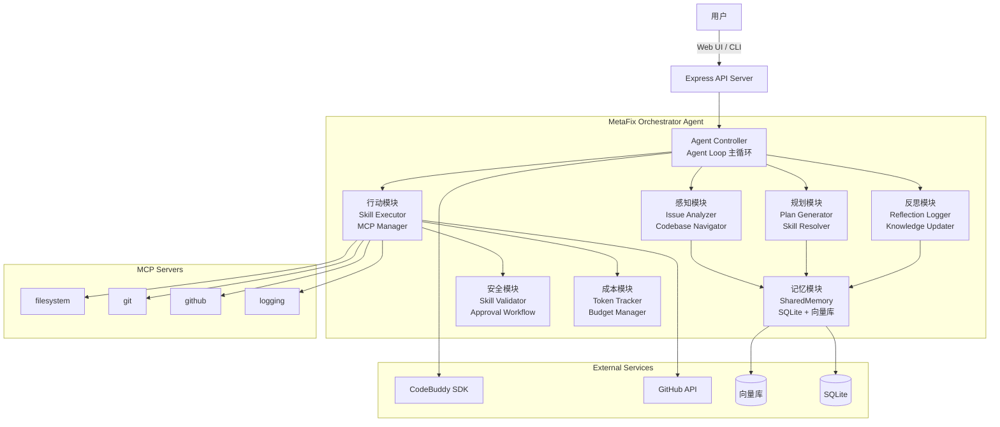

## 产品概述

MetaFix Orchestrator 是一个**自主决策型 AI Agent**，用于企业级智能缺陷修复。给它一个 Issue 链接（或问题描述），它会自主完成：感知分析 → 动态规划 → 执行修复 → 反思学习 → 提交 PR 的完整闭环。

## 核心功能

- **感知模块**：融合项目 Wiki（`.meta-fix/wiki/`）、预定义规则（`.meta-fix/rules/`）、历史记忆、CodeBuddy 代码分析，定位 Issue 根因
- **规划模块**：动态生成修复计划（非硬编码工作流），包含步骤、所需技能、风险点、token 成本预估，展示给用户确认
- **行动模块**：按五级优先级自主获取技能（预制子智能体 → 本地缓存 → 远程拉取 → 自动创建 → 组合），通过 MCP 工具（filesystem, git, github, logging）操作代码，失败自动重试/回滚/重新规划
- **反思模块**：每次修复后更新技能知识库（成功率、耗时），记录反思日志，优化未来决策
- **安全与成本**：技能四阶段校验、高危操作触发人工审批、token 预算控制
- **双交互模式**：Web UI（React + TDesign）实时展示 Agent 思考过程；CLI 命令行支持 `/fix &lt;issue-url&gt;` 快速修复
- **可观测性**：结构化日志、状态快照、重启恢复

## 用户交互流程（Demo）

1. 用户输入：`/fix https://github.com/vllm-project/vllm/issues/999`
2. Web UI 展示 Agent 思考过程（感知 → 规划 → 行动 → 反思）
3. 规划阶段展示修复计划，等待用户确认
4. 执行阶段实时展示技能拉取、代码修改、测试运行
5. 完成后展示反思日志和 PR 链接

## Tech Stack Selection

- **前端**：React 18 + TypeScript + TDesign + Tailwind CSS + Vite 5
- **后端**：Express + TypeScript + SQLite（better-sqlite3）+ CodeBuddy Agent SDK
- **CLI**：Commander.js + Chalk + ora（基于同一后端 API）
- **向量库**：sqlite-vec（SQLite 向量扩展）或独立 ChromaDB（用于 RAG 和技能检索）
- **AI 编排**：混合模式 — CodeBuddy SDK（`query`/`unstable_v2_createSession`）用于主 Agent Loop；直接 LLM API 调用用于高频次子任务（技能生成、代码分析）
- **MCP 集成**：预置 filesystem, git, github, logging；技能可声明额外 MCP 服务器

## Implementation Approach

### 整体策略

基于 `init-cbc-sdk-web` 模板扩展，复用其 Express + CodeBuddy SDK 后端架构和 React + TDesign 前端架构。在模板基础上新增 Agent 核心模块、技能管理系统、知识库、CLI 工具。

### 关键决策与理由

1. **单一智能体视角**：系统视为一个智能体，内部模块协同，而非多智能体编排。理由：降低复杂度，符合用户"自主决策型 AI Agent"定位。
2. **混合 AI 编排**：CodeBuddy SDK 用于主循环（支持工具调用、权限控制、会话管理）；直接 API 调用用于高频子任务（降低延迟、节省成本）。
3. **技能隔离执行**：每个技能在临时子智能体中运行（通过 CodeBuddy SDK 创建临时 session）。理由：避免技能间相互污染，支持并行执行。
4. **SQLite + 向量扩展**：使用 sqlite-vec 扩展在 SQLite 中存储向量。理由：无需独立向量数据库，部署简单，适合本地开发和企业环境。
5. **状态快照 + 重启恢复**：定期保存 Agent 状态到 SQLite，支持异常中断后从快照恢复。理由：长时间运行的 Agent 需要容错能力。

### 性能考虑

- **向量检索**：使用 sqlite-vec 进行 ANN 搜索，O(log N) 复杂度；预计算技能嵌入，避免实时计算
- **技能缓存**：本地文件系统缓存远程技能，避免重复拉取
- **流式响应**：Web UI 通过 SSE 接收 Agent 思考过程，避免轮询
- **并行技能执行**：无依赖的技能步骤并行执行，缩短修复时间

## Implementation Notes

- **模板复用**：必须从 `init-cbc-sdk-web` 模板复制完整结构（使用 `copy-template.sh` 或手动复制），禁止从零编写代码
- **Windows 兼容**：模板中的 `copy-template.sh` 是 bash 脚本，Windows 下需使用 WSL 或手动复制模板内容
- **CodeBuddy SDK 版本**：模板使用 `@tencent-ai/agent-sdk: ^0.3.43`，需保持版本一致
- **SQLite WAL 模式**：已启用，支持高并发读写
- **MCP 服务器**：需独立安装 MCP 服务器（filesystem, git, github），或通过 npx 动态启动

## Architecture Design

### 系统架构图



### 数据流

1. 用户输入 Issue URL → Agent Controller 启动 Agent Loop
2. 感知模块调用 CodeBuddy API 分析代码，从向量库检索相似历史 Issue
3. 规划模块生成修复计划，从技能仓库解析所需技能
4. 行动模块创建临时子智能体，执行技能，通过 MCP 操作代码和 Git
5. 反思模块评估执行结果，更新技能成功率和向量库
6. 交付模块通过 GitHub MCP 创建 PR，通知用户

## Directory Structure

```
metafix-orchestrator/  [NEW] 项目根目录（从模板复制后扩展）
├── server/                      # 后端服务（扩展自模板）
│   ├── index.ts                 # [MODIFY] 扩展 API 路由，添加 Agent 相关端点
│   ├── db.ts                    # [MODIFY] 扩展数据库表（技能、知识库、反思日志）
│   ├── config.ts                # [NEW] 配置管理（环境变量、默认值）
│   ├── types.ts                 # [NEW] 扩展类型定义（Agent、Skill、Plan 等）
│   ├── agents/                  # [NEW] Agent 核心模块
│   │   ├── controller.ts       # Agent Controller：控制 Agent Loop 主循环
│   │   ├── perception.ts        # 感知模块：Issue 分析、代码库导航
│   │   ├── memory.ts           # 记忆模块：短期/长期记忆管理
│   │   ├── planner.ts          # 规划模块：修复计划生成
│   │   ├── executor.ts         # 行动模块：技能执行编排
│   │   └── reflector.ts        # 反思模块：执行评估、知识更新
│   ├── skills/                  # [NEW] 技能管理系统
│   │   ├── resolver.ts         # 技能解析器：五级优先级获取
│   │   ├── validator.ts        # 技能校验器：四阶段安全检查
│   │   ├── executor.ts         # 技能执行器：临时子智能体管理
│   │   └── repository.ts       # 技能仓库：本地缓存 + 远程拉取
│   ├── knowledge/               # [NEW] 知识库
│   │   ├── vector-db.ts        # 向量库接口（sqlite-vec 或 ChromaDB）
│   │   ├── rag.ts              # RAG 实现：检索增强生成
│   │   ├── skill-knowledge.ts  # 技能知识库：成功率、耗时、组合
│   │   └── updater.ts         # 知识库更新器：反思后更新
│   ├── mcp/                     # [NEW] MCP 管理
│   │   ├── manager.ts          # MCP 管理器：启动/停止 MCP 服务器
│   │   └── servers/            # 预置 MCP 服务器配置
│   ├── security/                # [NEW] 安全模块
│   │   ├── validator.ts        # 技能校验：四阶段校验
│   │   └── approval.ts         # 人工审批：高危操作确认
│   ├── cost/                    # [NEW] 成本控制
│   │   ├── token-tracker.ts    # Token 追踪：每次 LLM 调用前估算
│   │   └── budget.ts           # 预算管理：超预算暂停并请求用户
│   └── utils/                   # [NEW] 工具函数
│       ├── logger.ts           # 结构化日志：JSON 格式，支持级别
│       └── state-snapshot.ts   # 状态快照：定期保存，支持恢复
├── src/                         # 前端（扩展自模板）
│   ├── components/              # [MODIFY/NEW] UI 组件
│   │   ├── Sidebar.tsx         # [MODIFY] 添加 MetaFix 导航菜单
│   │   ├── Header.tsx          # [MODIFY] 添加 Agent 状态显示
│   │   ├── IssueInput.tsx      # [NEW] Issue 输入组件（URL/描述）
│   │   ├── PlanViewer.tsx      # [NEW] 修复计划展示组件
│   │   ├── ExecutionMonitor.tsx # [NEW] 执行过程实时监控
│   │   ├── ReflectionReport.tsx # [NEW] 反思日志展示
│   │   └── SkillManager.tsx   # [NEW] 技能管理界面
│   ├── pages/                   # [MODIFY/NEW] 页面
│   │   ├── ChatPage.tsx        # [MODIFY] 支持 MetaFix 模式切换
│   │   ├── IssuePage.tsx       # [NEW] Issue 分析页面
│   │   ├── PlanPage.tsx        # [NEW] 修复计划查看/确认页面
│   │   ├── ExecutionPage.tsx   # [NEW] 执行监控页面
│   │   └── HistoryPage.tsx     # [NEW] 历史修复记录
│   ├── hooks/                   # [NEW] 自定义 Hooks
│   │   ├── useAgent.ts         # Agent 控制 Hook（启动/停止/暂停）
│   │   ├── useSkills.ts        # 技能管理 Hook
│   │   └── useKnowledge.ts     # 知识库查询 Hook
│   ├── types.ts                 # [MODIFY] 添加 MetaFix 类型定义
│   └── ...                      # 其他模板文件保持不变
├── cli/                         # [NEW] CLI 工具
│   ├── index.ts                 # CLI 入口（Commander.js）
│   ├── commands/                # CLI 命令
│   │   ├── fix.ts              # /fix &lt;issue-url&gt; 命令
│   │   ├── analyze.ts          # /analyze &lt;issue-url&gt; 命令
│   │   └── history.ts          # /history 命令
│   └── utils/                   # CLI 工具函数
│       ├── api-client.ts       # 后端 API 客户端
│       └── formatter.ts        # 输出格式化（Chalk）
├── data/                        # [NEW] 数据目录
│   ├── chat.db                  # SQLite 数据库（模板已有）
│   ├── skills/                  # 本地技能缓存
│   ├── wiki/                    # 项目 Wiki（.meta-fix/wiki/）
│   ├── rules/                   # 预定义规则（.meta-fix/rules/）
│   └── snapshots/               # Agent 状态快照
├── .env.example                 # [MODIFY] 添加 MetaFix 相关环境变量
├── package.json                 # [MODIFY] 添加依赖和 CLI 脚本
├── tsconfig.json                # [MODIFY] 添加 cli/ 编译配置
└── vite.config.ts               # 保持不变
```

## Key Code Structures

### 核心类型定义

```typescript
// server/types.ts

/** Agent 循环状态 */
export type AgentState = 'idle' | 'perceiving' | 'planning' | 'executing' | 'reflecting' | 'delivering' | 'error';

/** 修复计划 */
export interface FixPlan {
  id: string;
  issueId: string;
  steps: PlanStep[];
  estimatedTokens: number;
  estimatedCost: number;
  riskLevel: 'low' | 'medium' | 'high';
  requiresApproval: boolean;
  createdAt: string;
}

/** 计划步骤 */
export interface PlanStep {
  id: string;
  description: string;
  targetFiles: string[];
  requiredSkills: string[];
  status: 'pending' | 'running' | 'completed' | 'failed';
  retryCount: number;
}

/** 技能定义 */
export interface Skill {
  id: string;
  name: string;
  version: string;
  description: string;
  author: string;
  source: SkillSource;
  requiredMcps: string[];
  successRate: number;
  avgDuration: number;
  createdAt: string;
  updatedAt: string;
}

/** 技能来源（五级优先级） */
export type SkillSource = 
  | 'preset-agent'     // 1. 预制子智能体
  | 'local-cache'      // 2. 本地缓存
  | 'remote-fetch'     // 3. 远程拉取
  | 'auto-create'      // 4. 自动创建
  | 'composite';       // 5. 组合

/** 反思日志 */
export interface ReflectionLog {
  id: string;
  sessionId: string;
  planId: string;
  expectedOutcome: string;
  actualOutcome: string;
  skillPerformance: SkillPerformance[];
  lessonsLearned: string[];
  knowledgeUpdates: KnowledgeUpdate[];
  createdAt: string;
}

/** 技能表现 */
export interface SkillPerformance {
  skillId: string;
  success: boolean;
  duration: number;
  errorMessage?: string;
}
```

## 设计风格

采用**现代科技风格**，突出 AI Agent 的智能感和自主决策能力。

### 整体布局

- **左侧边栏**：导航菜单（New Fix、History、Skills、Settings），显示当前 Agent 状态
- **主内容区**：根据当前页面动态切换
- Issue 输入页：大型输入框 + 项目配置
- 计划展示页：步骤卡片 + 风险指示器 + 确认按钮
- 执行监控页：实时日志流 + 进度条 + 技能执行状态
- 反思报告页：对比表格 + 知识更新摘要

### 视觉特色

- **Agent 思考动画**：规划阶段展示"思考中"动画（脉冲、渐变）
- **实时日志流**：执行阶段 SSE 推送日志，逐行显示，支持语法高亮
- **状态指示**：每个模块（感知/规划/行动/反思）有独立状态指示灯
- **深色主题**：默认深色，减少长时间使用的视觉疲劳
- **玻璃拟态**：卡片使用半透明背景 + 模糊效果

### 交互设计

- **计划确认**：展示完整计划，用户可编辑步骤或拒绝高风险操作
- **实时反馈**：执行过程中实时显示当前步骤、耗时、token 消耗
- **反思展示**：完成后展示前后对比，突出改进点
- **快捷键**：支持 Ctrl+Enter 提交、Esc 暂停、Ctrl+C 停止

### 响应式设计

- 桌面端：完整布局，侧边栏展开
- 平板端：侧边栏可折叠
- 移动端：底部导航栏，简化视图

## Agent Extensions

### Skill: init-cbc-sdk-web

- **Purpose**: 初始化项目模板，复制完整项目结构到工作目录
- **Expected outcome**: 项目目录包含完整的模板文件（server/, src/, package.json 等），可直接安装依赖并启动开发服务器

### Skill: skill-creator

- **Purpose**: 创建自定义技能（用于"自动创建"技能来源）
- **Expected outcome**: 根据需求自动生成技能代码，包括 skill.ts、prompt、测试用例