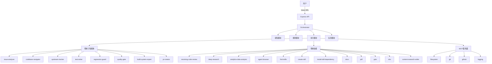

## 需求概述

补全 MetaFix Orchestrator 的所有预置组件，实现完整版本。

## 核心功能

### 1. 预制子智能体（8个）

实现以下子智能体为独立的 .ts 模块，导出异步函数，接收 session 和 context，返回结构化结果：

- `issue-analyzer`：深度分析 Issue，结合 Wiki/规则确定根因、影响模块、严重程度
- `codebase-navigator`：快速定位代码位置、理解项目结构、分析依赖关系
- `upstream-tracker`：对比项目与上游仓库的差异，追踪 API 变更
- `test-writer`：根据修复内容编写单元测试、集成测试、回归测试
- `regression-guard`：运行全量或增量回归测试，验证修复不引入新问题
- `quality-gate`：执行最终检查（代码规范、安全扫描、测试覆盖率）
- `build-system-expert`：处理 CMake、Makefile 等构建系统配置及依赖问题
- `pr-creator`：自动创建 GitHub PR，生成描述、标签、关联 Issue

### 2. 预制技能（12个）

实现以下技能，包含技能定义和实现代码：

- `receiving-code-review`：接收 PR 审查意见并实施修改
- `deep-research`：多源信息综合、引用、分析
- `analytics-data-analysis`：数据可视化、Jupyter、Python 数据分析
- `agent-browser`：网页操作、GitHub 信息抓取、表单填写
- `find-skills`：搜索和安装新技能（从社区）
- `create-skill`：创建新技能、编写 SKILL.md`
- `install-skill-dependency`：修复技能缺失的依赖项`
- `docx`：Word 文档创建、修改、检查`
- `pdf`：PDF 读取、合并、拆分、创建`
- `pptx`：PPT 幻灯片创建与解析`
- `xlsx`：Excel 表格读写与处理`
- `content-research-writer`：协作写作、研究、引用管理`

### 3. 预制 MCP（4个）

- `filesystem`：已配置可用，依赖外部 @modelcontextprotocol/server-filesystem`
- `git`：已配置可用，依赖外部 @modelcontextprotocol/server-git`
- `github`：已配置可用，依赖外部 @modelcontextprotocol/server-github`
- `logging`：配置引用了 servers/logging-server.js 但该文件不存在，需要创建`

### 4. 常驻调度器（1个）

- `workflow-orchestrator`：当前逻辑分散在 controller.ts 的 runAgentLoop() 和 index.ts 的 HTTP 入口中，需要抽取为独立文件 server/agents/orchestrator.ts`

## 技术栈

- 语言：TypeScript (Node.js)
- 框架：Express.js (服务端), @tencent-ai/agent-sdk (AI 能力)
- 数据库：SQLite (better-sqlite3)
- MCP：@modelcontextprotocol/server-filesystem, @modelcontextprotocol/server-git, @modelcontextprotocol/server-github

## 实现方案

### 架构设计



### 1. 调度器抽取

从 controller.ts 抽取 runAgentLoop() 到独立的 orchestrator.ts，提供清晰的职责分离。

- orchestrator.ts 导出 runAgentLoop(sessionId) 和辅助函数
- controller.ts 改为调用 orchestrator 的函数

### 2. 子智能体实现模式

每个子智能体实现为独立的 .ts 文件，遵循现有模式：

- 导出异步函数，接收 (session, context)
- 使用 config, db, query (from @tencent-ai/agent-sdk)
- 使用 uuid 生成 ID
- 日志前缀 SubAgentName
- 返回结构化对象，定义清晰的 TypeScript 接口

### 3. 技能实现模式

技能实现为 .ts 文件（技能执行器）：

- 技能执行器：导出 execute(context) 函数
- 注册到数据库（db.createSkill()）
- 添加到 resolver.ts 的 PRESET_AGENTS 列表

### 4. Logging MCP 修复

创建 server/mcp/servers/logging-server.js，实现标准的 MCP 服务器：

- 使用 child_process 创建 Node.js 进程
- 通过 stdio 与主机通信，遵循 MCP 协议
- 提供 log 工具：记录结构化日志到 data/logs/
- 提供 get_logs 工具：检索历史日志

## 目录结构

```
server/
├── agents/
│   ├── orchestrator.ts          [NEW] 独立调度器
│   ├── issue-analyzer.ts        [NEW] Issue 分析子智能体
│   ├── codebase-navigator.ts    [NEW] 代码库导航子智能体
│   ├── upstream-tracker.ts      [NEW] 上游追踪子智能体
│   ├── test-writer.ts           [NEW] 测试编写子智能体
│   ├── regression-guard.ts     [NEW] 回归防护子智能体
│   ├── quality-gate.ts         [NEW] 质量门禁子智能体
│   ├── build-system-expert.ts  [NEW] 构建系统专家子智能体
│   ├── pr-creator.ts           [NEW] PR 创建子智能体
│   ├── controller.ts           [MODIFY] 调用 orchestrator
│   ├── perception.ts           [EXISTING] 感知模块
│   ├── planner.ts              [EXISTING] 规划模块
│   ├── executor.ts             [EXISTING] 执行模块
│   └── reflector.ts           [EXISTING] 反思模块
├── skills/
│   ├── presets/               [NEW] 预制技能目录
│   │   ├── receiving-code-review.ts
│   │   ├── deep-research.ts
│   │   ├── analytics-data-analysis.ts
│   │   ├── agent-browser.ts
│   │   ├── find-skills.ts
│   │   ├── create-skill.ts
│   │   ├── install-skill-dependency.ts
│   │   ├── docx.ts
│   │   ├── pdf.ts
│   │   ├── pptx.ts
│   │   ├── xlsx.ts
│   │   └── content-research-writer.ts
│   ├── resolver.ts             [MODIFY] 更新 PRESET_AGENTS
│   ├── executor.ts             [EXISTING] 技能执行器
│   ├── repository.ts           [EXISTING] 技能仓库
│   └── validator.ts           [EXISTING] 技能校验器
├── mcp/
│   ├── manager.ts             [EXISTING] MCP 管理器
│   └── servers/              [NEW] MCP 服务器目录
│       └── logging-server.js  [NEW] Logging MCP 服务器
└── db.ts                     [MODIFY] 添加技能初始化逻辑
```

## 关键代码结构

### 子智能体接口

```typescript
// server/agents/types.ts
export interface SubAgentContext {
  session: any;
  perception?: any;
  plan?: any;
  executionResult?: any;
}

export interface SubAgentResult {
  success: boolean;
  output: string;
  data?: any;
}
```

### 技能接口

```typescript
// server/skills/types.ts
export interface SkillContext {
  session: any;
  step: any;
  perception?: any;
  plan?: any;
}

export interface SkillResult {
  success: boolean;
  output: string;
  data?: any;
}
```